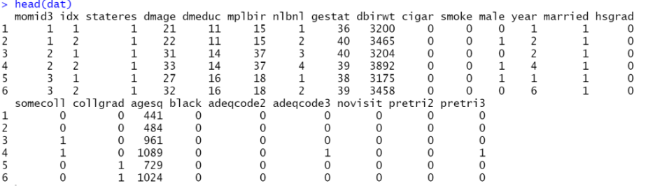
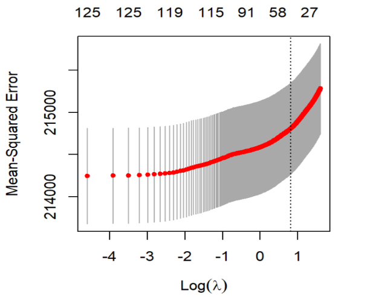
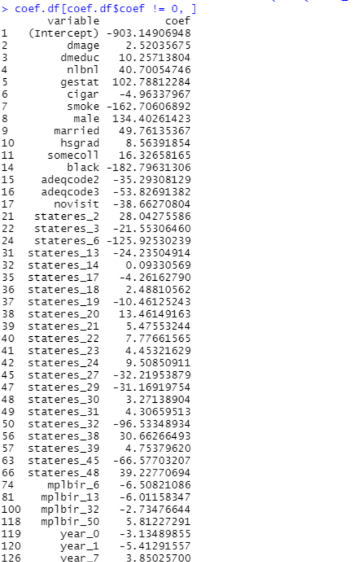

# Maternal Smoking and Infant Birth Weight Analysis

## Introduction
This project investigates the causal relationship between maternal smoking during pregnancy and infant birth weight. Using econometric methods such as LASSO regression and Two-Stage Least Squares (2SLS) with instrumental variables (IV), we estimate the impact of maternal smoking on birth weight.

## Methodology
### 1. Data Preparation
- The dataset `birpanel.csv` contains information on maternal health, smoking habits, and infant birth outcomes.
- Missing values in the `cigar` variable were replaced using the mean imputation method.
- Categorical variables (`stateres`, `mplbir`, `year`) were converted into dummy variables for analysis.

### 2. Model Selection
- **Forward Selection**: To identify significant predictors for birth weight.
- **LASSO Regression**: Used for variable selection and regularization, optimizing model fit.

### 3. Instrumental Variable Analysis
- **Instrumental Variable**: Maternal education (`dmeduc`) serves as an instrument for maternal smoking (`cigar`).
- **Two-Stage Least Squares (2SLS)**: Estimation of the causal effect of smoking on birth weight.
- **Durbin-Wu-Hausman Test**: Ensures the validity of the IV model by comparing OLS and 2SLS estimates.

## Results
### First-stage Regression Results (Table 3)
| Variable | Coef.     | Std. Err. | t      | P>|t| | [95% Conf. Interval] |
|----------|-----------|-----------|--------|-----|-----------------------|
| dmeduc   | -0.57109  | 0.005047  | -113.17| 0.000| -0.58099  -0.5612     |

### Second-stage Regression Results (Table 4)
| Variable | Coef.     | Std. Err. | t      | P>|t| | [95% Conf. Interval] |
|----------|-----------|-----------|--------|-----|-----------------------|
| Cigar    | -32.87212 | 0.897010  | -36.65 | 0.000| -34.63023  -31.11402  |

## Figures 
### 1. Data Description (Table 1)

### 2. MSE of Different Lambda (Figure 1)

### 3. Coefficient of Variables (Table 2)

